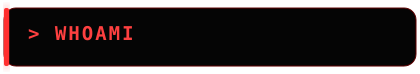
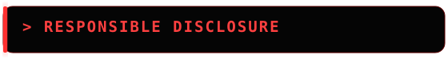
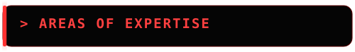
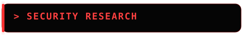
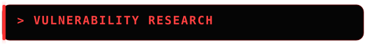
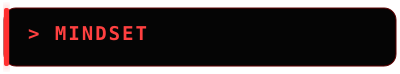
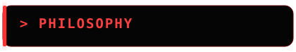

<div align="center">


<br>


<br><br>


<br><br>

<a href="https://github.com/sudaisnazir2381-lang">

</a>
<a href="mailto:sudaisnazir2381@gmail.com">

</a>

</div>

---

<div align="center">

</div>

<div align="center">

```text
╔══════════════════════════════════════════════════╗
║                                                  ║
║                 SYSTEM ONLINE                    ║
║                                                  ║
║   USER      : SUDAIS NAZIR                       ║
║   AGE       : 15                                 ║
║   STATUS    : STATE VERIFIED                     ║
║   SPECIALTY : PENETRATION TESTING                ║
║                                                  ║
╚══════════════════════════════════════════════════╝
```

</div>

<div align="center">

<table>
<tr>
<td align="center">

I started my cybersecurity journey at **13** and have been building practical security experience ever since.

I'm a **State Verified cybersecurity researcher and pentester**, with a strong focus on **penetration testing, web application security, bug bounty hunting, API security, OSINT, and vulnerability research**.

I enjoy understanding how applications work, identifying security weaknesses, and responsibly reporting vulnerabilities.

</td>
</tr>
</table>

</div>

---


<div align="center">

### `PRIMARY SPECIALTY`


<br><br>


</div>

My primary specialty is **Penetration Testing**, with a strong focus on web applications, APIs, authentication, authorization, and vulnerability research.

I also have hands-on experience in **Bug Bounty Hunting, OSINT, Reconnaissance, Web Security, and API Security**.

---

<div align="center">

</div>

<div align="center">

### `HALL OF FAME`

<br>

<a href="https://www.basf.com/global/en/legal/responsible-disclosure-statement">

</a>

<a href="https://pescheck.io/responsible-disclosure-hall-of-fame/">

</a>

<a href="https://lespasoftware.com/security.html">

</a>

<a href="https://www.gokoppa.com/security/hall-of-fame/">

</a>

<br><br>

<a href="https://www.unistra.fr/.well-known/hall-of-fame.txt">

</a>

<a href="https://gbtwente.nl/responsible-disclosure">

</a>

<a href="https://www.pro4all.com/legal/responsible-disclosure">

</a>

<br><br>

`BASF` • `PESCHECK` • `LESPA SOFTWARE` • `KOPPA`
`UNISTRA` • `GBTWENTE` • `PRO4ALL`

</div>

---

<div align="center">

</div>

<div align="center">

<table>
<tr>

<td align="center" width="220">

### `WEB`

XSS  
SQL Injection  
SSRF  
CSRF  
XXE  
CORS  
IDOR  
Clickjacking  
HTTP Smuggling

</td>

<td align="center" width="220">

### `AUTH`

Authentication  
Authorization  
OAuth  
Sessions  
Password Reset  
Rate Limiting  
Account Security

</td>

<td align="center" width="220">

### `API`

API Security  
Access Control  
Business Logic  
Input Validation  
Information Disclosure  
Authorization Testing

</td>

</tr>
</table>

</div>

---

<div align="center">

</div>

<div align="center">

```text
┌──────────────────────────────────────────────────┐
│              SECURITY RESEARCH                   │
├──────────────────────────────────────────────────┤
│                                                  │
│  [01] Web Application Security                   │
│  [02] API Security                               │
│  [03] Authentication & Authorization             │
│  [04] OAuth Security                             │
│  [05] CSRF / CORS / SSRF                         │
│  [06] Vulnerability Research                     │
│  [07] Bug Bounty Hunting                         │
│  [08] OSINT & Reconnaissance                     │
│                                                  │
└──────────────────────────────────────────────────┘
```

</div>

My research focuses on understanding **application logic and security assumptions**, rather than simply relying on automated scanners.

I like investigating:

* Authentication and authorization
* Password-reset functionality
* Account and email enumeration
* Rate-limit weaknesses
* OAuth flows
* API access control
* Information disclosure
* Business logic vulnerabilities
* Infrastructure security
* Resource-exhaustion issues

---

<div align="center">

</div>

<div align="center">


<br><br>


</div>

Hands-on experience researching and responsibly disclosing vulnerabilities in real-world applications.

---

<div align="center">

</div>

<div align="center">


<br>

```text
        ┌─────────────┐
        │   OBSERVE   │
        └──────┬──────┘
               │
               ▼
        ┌─────────────┐
        │   ANALYZE   │
        └──────┬──────┘
               │
               ▼
        ┌─────────────┐
        │    TEST     │
        └──────┬──────┘
               │
               ▼
        ┌─────────────┐
        │ UNDERSTAND  │
        └──────┬──────┘
               │
               ▼
        ┌─────────────┐
        │   REPORT    │
        └──────┬──────┘
               │
               ▼
        ┌─────────────┐
        │   SECURE    │
        └─────────────┘
```

</div>

---

<div align="center">

</div>

<div align="center">

### **"Don't just learn the vulnerability. Learn why it exists."**

<br>


</div>

---

<div align="center">

```text
╔════════════════════════════════════════════════╗
║                                                ║
║            CONNECTION ESTABLISHED              ║
║                                                ║
║                  0xFF3333                      ║
║                                                ║
║              STATE VERIFIED                    ║
║                                                ║
║       KEEP LEARNING • KEEP BUILDING            ║
║              STAY ETHICAL                      ║
║                                                ║
╚════════════════════════════════════════════════╝
```

<br>


</div>
